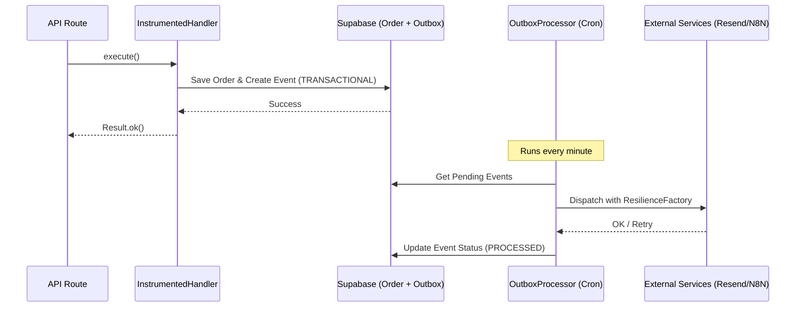

# Architecture V2: Reliability & Event-Driven Flows

Este documento detalla la evolución de la arquitectura del Dropservice Platform hacia un sistema más robusto y observable.

## 1. Patrones de Diseño Implementados

### Outbox Pattern (Eventos Fiables)
- **Problema**: Las notificaciones (email/webhooks) pueden fallar por problemas externos, perdiendo información crítica.
- **Solución**: Los eventos se persisten primero en la tabla `event_outbox` dentro de la misma transacción de la base de datos que el comando principal. Un `OutboxProcessor` (Cron) los despacha de forma asíncrona.

### Resilience Layer
- **ResilienceFactory**: Envuelve todas las llamadas I/O externas con políticas de reintento (backoff exponencial) y timeouts.
- **Circuit Breaker**: (Preparado) Para evitar degradación del sistema cuando un proveedor externo (Resend/N8N) está caído.

### Deep Optimization Engine (NASA-Grade Audit)
- Un sistema de escaneo estratificado que audita las capas de Dominio, Persistencia y Seguridad, generando un "Health Score" del sistema.

## 2. Diagrama de Flujo de Eventos

## 3. Telemetría 2.0
- **Contexto Propagado**: Cada operación genera un `traceId` que fluye desde la API hasta los logs del worker, permitiendo una trazabilidad fin-a-fin.
- **Métricas de Negocio**: Integradas en el flujo del handler (Revenue, Conversión, Latencia de Despacho).
