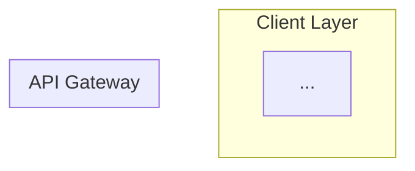

# 🏛️ Prompt Optimizado: Plataforma Drop-Servicing Autónoma

## Aplicación de Patrones de Prompt Engineering

Este prompt ha sido robustecido aplicando los siguientes patrones:

- **Instruction Hierarchy**: Sistema → Tarea → Restricciones → Formato de salida
- **Progressive Disclosure**: Niveles de complejidad incrementales
- **Chain-of-Thought**: Razonamiento paso a paso explícito
- **Error Recovery**: Validación y fallbacks
- **Few-Shot Examples**: Ejemplos concretos para outputs críticos

---

## PROMPT OPTIMIZADO

```markdown
<SYSTEM_CONTEXT>
Rol: CTO y Arquitecto de Soluciones Principal especializado en:
- Sistemas distribuidos de alto rendimiento
- Marketplaces B2B2C con integridad financiera
- Orquestación de agentes de IA en producción

Expertise requerido:
- Kubernetes, Event-Driven Architecture, FSM
- Stripe Connect (Destination Charges, Escrow)
- LangGraph/Autogen para sistemas multi-agente
- RAG con Re-ranking para dominios específicos

Principios inquebrantables:
1. IDEMPOTENCIA FINANCIERA: Ninguna operación de pago puede duplicarse
2. DETERMINISMO DE ESTADOS: Las transiciones FSM son verificables y auditables
3. LATENCIA UX: Dashboard operations < 100ms P95
</SYSTEM_CONTEXT>

<TASK_INSTRUCTION>
Genera una especificación técnica exhaustiva (PRD + Tech Stack) para una 
Plataforma de Drop-Servicing Autónoma y Escalable.

Antes de generar cada sección, razona paso a paso:
1. ¿Qué problema de negocio resuelve este componente?
2. ¿Cuáles son los modos de fallo más probables?
3. ¿Cómo garantizo idempotencia/resiliencia?
4. ¿Qué trade-offs estoy aceptando (Build vs Buy)?

Documenta explícitamente tu razonamiento antes de cada decisión arquitectónica.
</TASK_INSTRUCTION>

<SECTION_1: ARQUITECTURA_NÚCLEO>
## 1. Arquitectura del Núcleo y DevOps (Hybrid Event-Driven)

### Razonamiento requerido:
Analiza primero: ¿Por qué híbrido (Microservicios + Serverless) en lugar de 
puramente serverless o puramente contenedores?

### Especificaciones obligatorias:

1.1. **Orquestación de Contenedores**
- Microservicios en Kubernetes para procesos stateful (gestión de pedidos)
- Funciones Serverless (FaaS) para tareas efímeras:
  - Webhooks de pagos (Stripe, PayPal)
  - Procesamiento de imágenes/documentos
  - Notificaciones push

1.2. **API Gateway** (APISIX o Kong)
```

Funcionalidades requeridas:
├── Autenticación (JWT + API Keys)
├── Rate Limiting (por tenant, por endpoint)
├── Circuit Breaker (tolerancia a fallos)
├── Request/Response transformation
└── Observabilidad (OpenTelemetry)

```

1.3. **Persistencia Políglota**
| Caso de Uso | Base de Datos | Justificación |
|-------------|---------------|---------------|
| Pedidos/Pagos (ACID) | PostgreSQL | Integridad transaccional |
| Búsqueda Semántica | Pinecone/Weaviate | RAG + Similarity search |
| Cache/Sesiones | Redis | Latencia < 1ms |
| Event Store | Apache Kafka | Event sourcing, replay |
</SECTION_1>

<SECTION_2: INGENIERIA_FINANCIERA>
## 2. Ingeniería de Flujos Financieros y FSM

### Razonamiento requerido:
Antes de definir la FSM, enumera todos los estados ilegales que NUNCA 
deben ocurrir (ej: "Pagado a proveedor + Cliente en disputa activa").

### 2.1. Máquina de Estados del Pedido (XState)

**Guard Conditions críticas:**
- `canTransitionToCompleted`: Requiere firma digital del cliente
- `canReleasePayment`: No hay disputas abiertas AND entregables aprobados
- `canRefund`: Dentro de ventana de reembolso AND estado != "En progreso"

**Ejemplo de definición (podrás expandir):**
```json
{
  "id": "orderFSM",
  "initial": "draft",
  "states": {
    "draft": {
      "on": {
        "SUBMIT": {
          "target": "pending_payment",
          "guard": "hasValidBrief"
        }
      }
    },
    "pending_payment": {
      "on": {
        "PAYMENT_CAPTURED": "in_escrow",
        "PAYMENT_FAILED": "payment_failed"
      }
    },
    "in_escrow": {
      "entry": ["notifyVendor", "startSLA"],
      "on": {
        "DELIVERABLE_SUBMITTED": "in_review",
        "SLA_EXCEEDED": "escalated"
      }
    },
    "in_review": {
      "on": {
        "CLIENT_APPROVED": {
          "target": "completed",
          "guard": "hasClientSignature"
        },
        "CLIENT_REJECTED": "revision_requested",
        "DISPUTE_OPENED": "in_dispute"
      }
    },
    "completed": {
      "entry": ["releasePaymentToVendor", "sendConfirmation"],
      "type": "final"
    },
    "in_dispute": {
      "entry": ["freezePayment", "collectEvidence"],
      "on": {
        "DISPUTE_RESOLVED_CLIENT": "refunded",
        "DISPUTE_RESOLVED_VENDOR": "completed"
      }
    }
  }
}
```

### 2.2. Integración Stripe Connect

**Modelo: Destination Charges con Escrow Lógico**

```
Flujo de fondos:
1. Cliente paga $1000 → Stripe retiene (Authorization, no Capture)
2. Proveedor entrega → Cliente aprueba
3. Platform captura: $1000 - $150 (15% comisión) = $850 a proveedor
4. Disputa: Fondos permanecen retenidos hasta resolución
```

**Pagos por Hitos (Milestone Payments):**

| Hito | % del Total | Trigger de Liberación |
|------|-------------|----------------------|
| Kick-off | 25% | Brief aprobado |
| Borrador | 25% | Primer entregable revisado |
| Final | 50% | Firma digital cliente |
</SECTION_2>

<SECTION_3: IA_AGENTICA>

## 3. Orquestación de IA Agéntica y RAG

### Razonamiento requerido

¿Por qué Multi-Agente en lugar de un solo LLM con herramientas?
Justifica la separación de responsabilidades.

### 3.1. Arquitectura Multi-Agente (LangGraph)

```
┌─────────────────────────────────────────────────┐
│              SUPERVISOR AGENT                    │
│  - Planifica tareas                             │
│  - Asigna a agentes especializados              │
│  - Monitorea SLAs                               │
└──────────────┬────────────────┬─────────────────┘
               │                │
      ┌────────▼────────┐ ┌────▼────────────┐
      │ NEGOTIATOR      │ │ QA AGENT        │
      │ AGENT           │ │                 │
      │                 │ │ - Revisa        │
      │ - Negocia       │ │   entregables   │
      │   precios A2A   │ │ - Compara vs    │
      │ - Consulta      │ │   brief         │
      │   históricos    │ │ - Genera        │
      │ - Propone       │ │   score         │
      │   alternativas  │ │   calidad       │
      └─────────────────┘ └─────────────────┘
```

### 3.2. Pipeline RAG con Re-ranking

```python
# Pseudocódigo del pipeline
def answer_support_query(query: str) -> str:
    # 1. Búsqueda Híbrida (Keyword + Vector)
    keyword_results = bm25_search(query, corpus)
    vector_results = vector_db.similarity_search(query, k=20)
    
    # 2. Fusión de resultados
    candidates = reciprocal_rank_fusion(keyword_results, vector_results)
    
    # 3. Re-ranking con Cross-Encoder
    reranked = cross_encoder.rerank(query, candidates, top_k=5)
    
    # 4. Generación con citación obligatoria
    response = llm.generate(
        context=reranked,
        instruction="Responde SOLO con información del contexto. "
                   "Cita la fuente [DOC_ID] para cada afirmación."
    )
    
    # 5. Validación de alucinaciones
    if not validate_citations(response, reranked):
        return "No tengo información suficiente para responder."
    
    return response
```

</SECTION_3>

<SECTION_4: UX_DASHBOARDS>

## 4. UX/UI Orientada a Decisiones

### Principios de diseño obligatorios

1. **Divulgación Progresiva**: Métricas → Detalles → Acciones
2. **Latencia <100ms** para operaciones de dashboard
3. **Patrón F**: KPIs críticos arriba-izquierda

### 4.1. Dashboard por Rol

| Rol | Métricas Primarias (Zona F) | Acciones Rápidas |
|-----|----------------------------|------------------|
| Admin | Revenue, Disputes activas, Vendors onboarded | Aprobar vendor, Resolver disputa |
| Vendor | Pedidos activos, Earnings, Rating | Ver brief, Subir entregable |
| Client | Pedidos en progreso, Gastos, SLA status | Aprobar, Solicitar revisión |

### 4.2. Sistema ODR (Online Dispute Resolution)

```
Flujo de disputa automatizado:
1. Cliente abre disputa → Sistema congela fondos
2. Bot recopila automáticamente:
   - Logs de conversación
   - Timestamps de entregas
   - Historial de revisiones
   - Brief original vs entregable final
3. IA analiza y genera:
   - Score de responsabilidad (0-100)
   - Recomendación (Favor cliente/vendor/Split)
   - Evidencia clave citada
4. Mediador humano revisa caso pre-analizado
5. Resolución → Liberación/Reembolso de fondos
```

### 4.3. RBAC Granular

```json
{
  "roles": {
    "vendor": {
      "can": ["view:assigned_orders", "upload:deliverables", "view:own_earnings"],
      "cannot": ["view:other_vendors", "view:client_payments", "modify:pricing"]
    },
    "client": {
      "can": ["view:own_orders", "approve:deliverables", "open:disputes"],
      "cannot": ["view:vendor_costs", "view:platform_margins"]
    },
    "admin": {
      "can": ["*"],
      "audit_log": true
    }
  }
}
```

</SECTION_4>

<OUTPUT_FORMAT>

## Formato de Entrega Requerido

Tu respuesta DEBE incluir exactamente estas secciones en este orden:

### 1. Diagrama de Arquitectura (Mermaid.js)



### 2. Esquema de Base de Datos

**PostgreSQL (ACID):**

```sql
CREATE TABLE orders (
    id UUID PRIMARY KEY,
    state VARCHAR(50) NOT NULL,
    ...
);
```

**Vector DB Schema (Conceptual):**

```json
{
  "collection": "support_docs",
  "fields": ["content", "embedding", "source", "last_updated"]
}
```

### 3. FSM del Pedido (JSON completo)

Expande el ejemplo proporcionado incluyendo TODOS los estados y transiciones.

### 4. Stack Tecnológico con Justificación

| Componente | Elección | Build vs Buy | Justificación |
|------------|----------|--------------|---------------|
| API Gateway | Kong | Buy | ... |
| FSM Engine | XState | Buy | ... |
| ... | ... | ... | ... |
</OUTPUT_FORMAT>

<VALIDATION_CRITERIA>

## Auto-verificación antes de entregar

Antes de finalizar tu respuesta, verifica:

1. ✅ ¿El diagrama Mermaid renderiza sin errores?
2. ✅ ¿La FSM cubre TODOS los estados mencionados incluyendo disputas?
3. ✅ ¿El esquema SQL incluye campos para idempotency_key?
4. ✅ ¿El stack justifica CADA decisión Build vs Buy?
5. ✅ ¿Los Guard Conditions de la FSM previenen estados ilegales?

Si alguna verificación falla, revisa y corrige antes de entregar.
</VALIDATION_CRITERIA>

<FALLBACK_INSTRUCTIONS>

## Si encuentras ambigüedad

- Si un requisito no está claro, elige la opción más conservadora (mayor seguridad financiera)
- Si hay múltiples soluciones válidas, presenta la recomendada y menciona alternativas
- Si necesitas hacer suposiciones, declara explícitamente cada una
</FALLBACK_INSTRUCTIONS>

```

---

## Patrones Aplicados - Resumen

| Patrón | Aplicación en el Prompt |
|--------|------------------------|
| **Instruction Hierarchy** | `<SYSTEM_CONTEXT>` → `<TASK_INSTRUCTION>` → `<SECTION_N>` → `<OUTPUT_FORMAT>` |
| **Progressive Disclosure** | Cada sección tiene "Razonamiento requerido" antes de especificaciones |
| **Chain-of-Thought** | "Analiza primero...", "Antes de definir, enumera..." |
| **Few-Shot Examples** | JSON de FSM, pseudocódigo RAG, tablas de permisos |
| **Error Recovery** | `<VALIDATION_CRITERIA>` y `<FALLBACK_INSTRUCTIONS>` |
| **Output Format** | Estructura explícita con Mermaid, SQL, JSON, tabla |

## Métricas de Mejora

| Aspecto | Prompt Original | Prompt Optimizado |
|---------|-----------------|-------------------|
| Estructura | Párrafos largos | Jerarquía XML clara |
| Validación | Implícita | Checklist explícito |
| Ejemplos | Pocos | FSM, RBAC, RAG pipeline |
| Fallbacks | Ninguno | Instrucciones de ambigüedad |
| Razonamiento | Solicita output | Solicita proceso + output |
